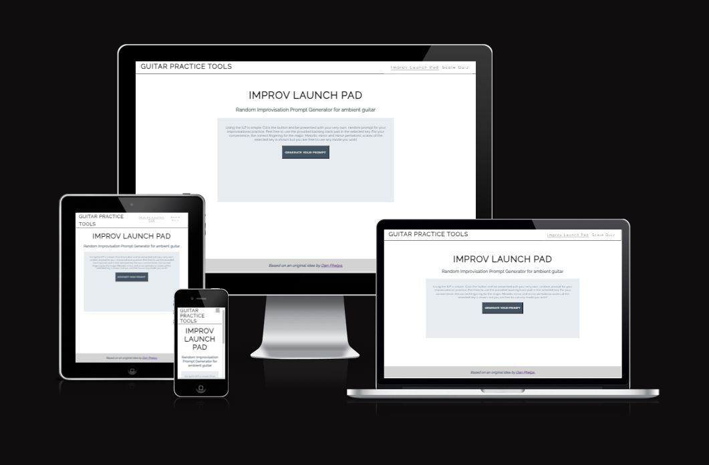

# Guitar Practice Tools

Guitar Practice tools is a site providing a suite of tools useful to the guitarist. It aims to provide the user with an interactive guitar practice structure. The site will also provide a scale learning quiz that tests the users scale knowledge and aims to to teach the ability to recognise scales by ear. 

It will be a basic site that will provide a good visual experience and clear images. The game is a great way to teach users the sound of different scales and then use that knowledge during practice.
users

The live link can be found here - [Guitar Practice tools](https://astro-mat.github.io/PP2/)

Table of Contents

<small><i><a href='http://ecotrust-canada.github.io/markdown-toc/'>Table of contents generated with markdown-toc</a></i></small>

## Site Owner Goals
- To provide the user with an easy to navigate game that is both fun and educational.
- To present the user with a website that is visually appealing and fully responsive.
- To present the user with an easy to use tool for prompting their improvisation practice.
- To entice the user to return to the game to improve their score.

## User Stories

- ### First Time User
  - As a first time user I want to understand the main purpose of the game
  - As a first time user I want to be able to intuitively navigate the game, play the game, see my score and restart the game once it ends.
  - As a first time user I want to be able to intuitively navigate the improv tool, randomise the prompt when I would like, play a backing track related to selected key and see fingering suggestions for that key.
  - As a first time user I want to have fun and learn about scales and improve my improvisation skills.

- ### Returning user
  - As a returning user I want to be able to play the same game without getting the same selection questions.
  - As a returning user I want to be able to get new improvisation prompts.

- ### Frequent user
  - As a frequent user I want to be able to be challenged further.
  - As a frequent user I want to be able to beat my previous score.

## Design

### Imagery
- The imagery and colour scheme of the site were both given careful consideration to ensure they compliment each other. The imagery used in the game is very important to the overall experience of the user. 
- A simple, no nonsense style was chosen to minimise distraction from the intent. 

### Colour Scheme

Colour palette from Coolors

- The colour scheme of the site is mainly subtle greys and blues. It was chosen to fit the simple nature and to provide high contrast. 

- Great care was taken to establish a good contrast between background colours and text at all times to ensure maximum user accessibility.

### Fonts
The Raleway font is the main font used throughout the whole website. This font was imported via [Google Fonts](https://fonts.google.com/). Again, this font seemed to fit the general asthetic of the site.
Sans Serif is used as a backup font, in case for any reason the main font isn't being imported into the site correctly.

### Layout
The site is made up of 2 sections:
  - Improv launchpad area
  - Scale Quiz

### Wireframes

Wireframes were produced using Balsamiq.

 

 
Desktop Wireframes

#### Desktop Wireframe - Improv Launch Pad

#### Desktop Wireframe - Scale Game

 

 

    
Mobile Wireframes

#### Mobile Wireframe - Improv Launch Pad

#### Mobile Wireframe - Scale Game

 

## Features

### Home Page - Improv Launch Pad

The landing page of the website is the Improve launchpad as this is seen as the main function of the site. There is a simple header that allows straightforward navigation 

 between the launchpad and the game. The user is invited to press a button that generates the practice prompt.
 

 And it also generates a backing track in the same key as the prompt and some example fingerings to reference while playing

### Scale quiz

The user can then navigate via the header nav bar to the scale quiz

The user can then push the play button in order to hear the scale. After hearing the scale, they can push one of four answers which they think the scale is. If correct, the button goes green and a next button becomes visible which takes them to the next question. 

If incorrect, the selected button turns red and the correct answer turns green. Thus giving the user the opportunity to learn from their mistake. The next button also appeers in this case.

After five attempts, the user is taken to a results page where the results are displayed and the opportunity to have another is given

## Testing

### Validator Testing
- #### HTML
    - No errors were returned when passing through the official W3C Markup Validator
        - [W3C Validator Results - Improv Launch Pad](https://validator.w3.org/nu/?doc=https%3A%2F%2Fastro-mat.github.io%2FPP2%2F)
        - [W3C Validator Results - Scale Quiz](https://validator.w3.org/nu/?doc=https%3A%2F%2Fastro-mat.github.io%2FPP2%2Fgame.html)

- #### CSS
    - No errors were found when passing through the official W3C CSS Validator 
        - [W3C CSS Validator Results](https://jigsaw.w3.org/css-validator/validator?uri=https%3A%2F%2Fastro-mat.github.io%2FPP2%2F&profile=css3svg&usermedium=all&warning=1&vextwarning=&lang=en)
- #### Javascript
    - No errors or warnings were returned when passing through the JS validator[JSHint Validator](https://jshint.com/)

  
  
  

### Accessibility 
- The site achieved a Lighthouse accessibility score of 100% on both mobile and desktop which confirms that the colours and fonts chosen are easy to read and accessible

Mobile Lighthouse Score

Desktop Lighthouse Score

### Button Testing
- All buttons were tested manually to ensure the user is directed to the correct section of the website and functions run as intended.

### Game Testing
- The game was thoroughly tested by friends and family to ensure that everything worked as intended including the following:
  - That the suggested fingerings and backing track match the suggested key
  - That all links work.
  - That the correct answers are actually correct.
  - that there is sufficient variation between different quiz questions
  - That the answers are correctly added at the end
  - That there is good legibility overall.

### Browser Testing
- The Website was tested on Google Chrome, Firefox, Microsoft Edge, Safari browsers with no issues noted.
    
### Device Testing
- The website was viewed on a variety of devices such as Desktop, Laptop, iPhone 8, iPhoneX and iPad to ensure responsiveness on various screen sizes in both portrait and landscape mode. The website performed as intended. The responsive design was also checked using Chrome developer tools across multiple devices with structural integrity holding for the various sizes.
- I also used the following website to test responsiveness:
    - [Responsinator](http://www.responsinator.com/?url=https%3A%2F%2Fastro-mat.github.io%2FPP2%2F)

### Fixed Bugs

Throughout the development there were several bugs that were noted and solved. These included;

#### The Quiz didn't cycle through question options
This was a simple fix of changing the array to be more varied. While I was doing this, I added more questions to make the quiz more challenging.

#### 

#### 

### Known Bugs
There are no known bugs.

## Technologies Used

### Languages
- JavaScript
- HTML5
- CSS3

### Frameworks - Libraries - Programs Used
- [Am I Responsive](http://ami.responsivedesign.is/) - Used to verify responsiveness of website on different devices.
- [Responsinator](http://www.responsinator.com/) - Used to verify responsiveness of website on different devices.
- [Balsamiq](https://balsamiq.com/) - Used to generate Wireframe images.
- [Chrome Dev Tools](https://developer.chrome.com/docs/devtools/) - Used for overall development and tweaking, including testing responsiveness and performance.
- [Font Awesome](https://fontawesome.com/) - Used for icons in information bar.
- [GitHub](https://github.com/) - Used for version control and hosting.
- [Google Fonts](https://fonts.google.com/) - Used to import and alter fonts on the page.
- [TinyPNG](https://tinypng.com/) - Used to compress images to reduce file size without a reduction in quality.
- [W3C](https://www.w3.org/) - Used for HTML & CSS Validation.
- [Coolors](https://coolors.co/) - Used to create colour palette.
- [Favicon](https://favicon.io/) - Used to create the favicon.
- [Soundcloud](https://soundcloud.com/) - Used to host the backing tracks.
- [all-guitar-chords](https://www.all-guitar-chords.com/scales) - Used to generate the Fingering images.

## Deployment

The site was deployed using GitHub pages. The steps to deploy using GitHub pages are:

1. Go to the repository on GitHub.com
2. Select 'Settings' near the top of the page.
3. Select 'Pages' from the menu bar on the left of the page.
4. Under 'Source' select the 'Branch' dropdown menu and select the main branch.
5. Once selected, click the 'Save'.
6. Deployment should be confirmed by a message on a green background saying "Your site is published at" followed by the web address.

The live link can be found here - [Guitar Practice Tools](https://astro-mat.github.io/PP2/)

## Cloning

To clone this repository follow the below steps: 

1. Locate the repository at this link [The Animal Association Game Repository](https://github.com/astro-mat/PP2.git). 
2. Under **'Code'**, see the different cloning options, HTTPS, SSH, and GitHub CLI. Click the prefered cloning option, and then copy the link provided. 
3. Open **Terminal**.
4. In Terminal, change the current working directory to the desired location of the cloned directory.
5. Type **'git clone'**, and then paste the URL copied from GitHub earlier. 
6. Type **'Enter'** to create the local clone. 

## Credits

### Content
The inspiration for the improvisation launch pad came from guitarist Dan Phelps [Dan Phelps](https://www.danphelps.com/). During the COvid 19 lockdown, he published the original version using a printed sheet and dice. He also recorded and released the backing tracks that are used in the launchpad [Improv launch pad loops](https://soundcloud.com/oceanographic/sets/ilp)

### Media
Images of suggested fingerings were sourced from:
 - [all-guitar-chords](https://www.all-guitar-chords.com/scales)

Scale audio files were created by myself using Ableton Live 11 
 - [Ableton Live](https://www.ableton.com/en/live/)

### Resources Used

- [W3Schools](https://www.w3schools.com/)  
- The following article was used to help shuffle the array in order to make the quiz more challenging
(Shuffle Array)[https://stackoverflow.com/questions/2450954/how-to-randomize-shuffle-a-javascript-array]
- This Youtube quiz tutorial was used when creating the scale quiz
(How To Make Quiz App Using JavaScript | Build Quiz App With HTML CSS & JavaScript)[https://www.youtube.com/watch?v=PBcqGxrr9g8&t=129s&ab_channel=GreatStack]
- This Random quote generator was helpful when developing the prompt generator
(Random Quote Generator | Javascript Beginner Project Tutorial)[https://www.youtube.com/watch?v=NmstSmMykqc]
- Elements were inspired by the code institute Love maths project 
[Code institute "Love Maths" Walk through project](https://learn.codeinstitute.net/courses/course-v1:CodeInstitute+LM101+2021_T1/courseware/2d651bf3f23e48aeb9b9218871912b2e/234519d86b76411aa181e76a55dabe70/?child=last)
- ...and the code institute Love running project 
[code institute "Love running walkthrough project](https://learn.codeinstitute.net/courses/course-v1:CodeInstitute+LRFX101+2023_Q2/courseware/e805068059af42af87681032aa64053f/1da6ad13213740f1855a51d30a2375b1/)

## Acknowledgments
My mentor Antonio for his support and advice.

The Code Institute slack community for their quick responses and very helpful feedback!

The code institute tutoring team for their help in problem solving.

GENERAL TEMP NOTES

Future improvements:
Different levels. Maybe, easy medium hard

TODO-------------------------
- delete this infor from the end
- READ
-compile table of contents

Credits:
Dan phelps who developed the toolkit but has since took down all references to it on his website. [danphelps.com](https://www.danphelps.com/)
Guitar scales generated from  [all-guitar-chords](https://www.all-guitar-chords.com/scales)
Code institute "Love Maths" Walk through project  [Code institute "Love Maths" Walk through project](https://learn.codeinstitute.net/courses/course-v1:CodeInstitute+LM101+2021_T1/courseware/2d651bf3f23e48aeb9b9218871912b2e/234519d86b76411aa181e76a55dabe70/?child=last)

CODE
https://stackoverflow.com/questions/1358810/how-do-i-change-the-text-of-an-element-using-javascript
Random Quote Generator:
https://www.youtube.com/watch?v=NmstSmMykqc
How To Make Quiz App Using JavaScript | Build Quiz App With HTML CSS & JavaScript
https://www.youtube.com/watch?v=PBcqGxrr9g8&t=129s&ab_channel=GreatStack
Shuffle array
https://stackoverflow.com/questions/2450954/how-to-randomize-shuffle-a-javascript-array
